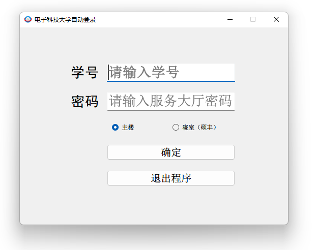
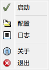

# uestc-login

## 程序简介
该程序适用于电子科大校园网自动登录，目前仅支持主楼、硕丰组团（不同域的网关好像不同，可自行测试添加），该程序基于PyQt5开发

## 使用方法
下载Release中的压缩包，打开main.exe，在弹出的窗口中输入学号以及服务大厅的密码，点击确认：

然后在任务栏的托盘上单击右键，点击启动即可:

### 开机自启动
如果你想开机自启动，Windows用户请在`C:\ProgramData\Microsoft\Windows\Start Menu\Programs\StartUp`下创建一个main.exe的快捷方式最方便。

> 不忍直视我的ui，我实在太懒了

## 说不定会做的
- [ ] 做好看点?
- [ ] 增加其他区域的支持
- [ ] 非明文存储用户信息
- [ ] 一键开机自启动

## 已知的问题
- 每次开启首次点击系统托盘右键卡顿
- 退出卡顿

## Acknowledgment
该程序仅供个人学习使用，严禁用于非法用途
